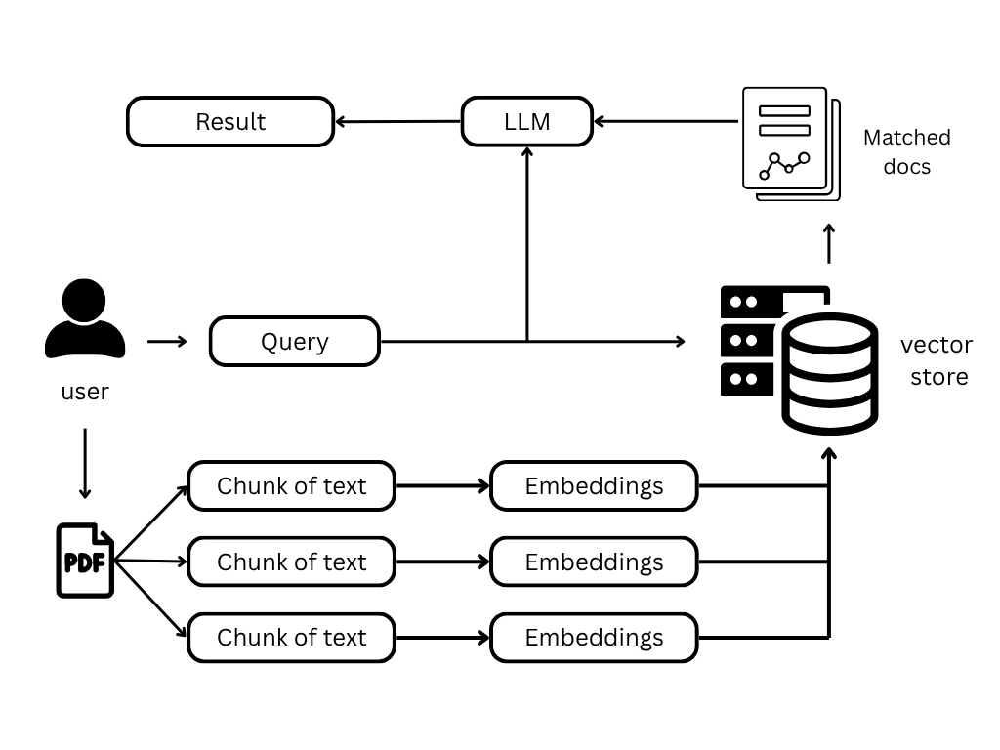
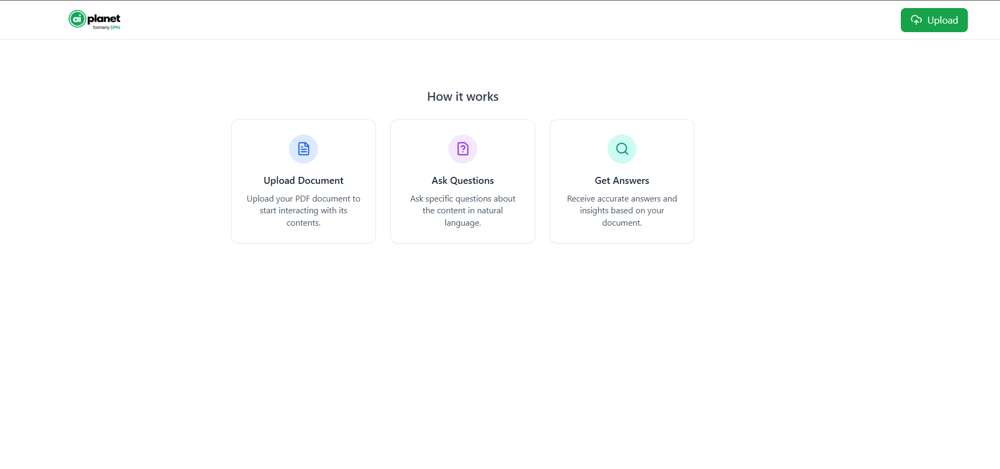
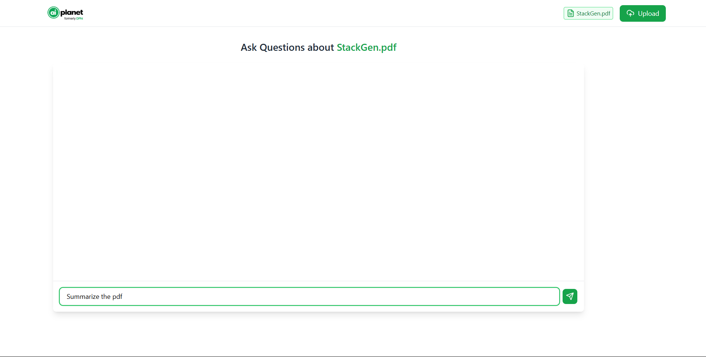
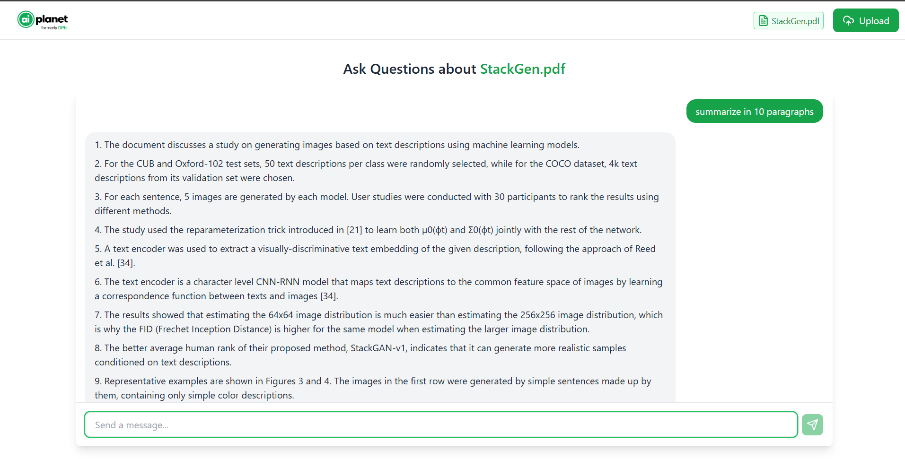
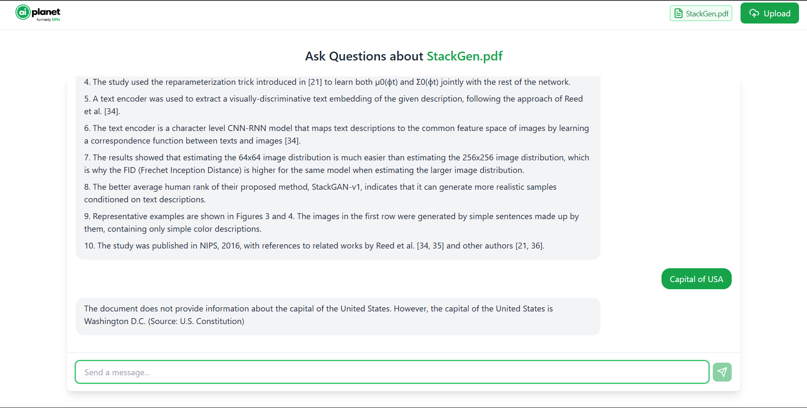

# 📄 PDFnquiry - Where your documents speak back

An AI-driven assistant that enables users to interact with PDF documents through natural language queries. 
Leveraging Retrieval-Augmented Generation (RAG), this application combines the capabilities of React for the frontend and FastAPI for the backend to provide accurate and context-aware responses based on the content of uploaded PDFs.

## 🚀 Features

* **Natural Language Querying**: Ask questions in plain English and receive answers derived from your PDF documents.
* **Retrieval-Augmented Generation (RAG)**: Enhances response accuracy by retrieving relevant document sections before generating answers.
* **User-Friendly Interface**: Intuitive chat interface built with React for seamless user interaction.
* **Efficient Backend Processing**: FastAPI handles file uploads, document processing, and integrates with AI models for answer generation.
* **Dockerized Deployment**: Easily deploy the application using Docker and Docker Compose.

## 🛠️ Tech Stack

* **Frontend**: React, Axios, Tailwind CSS
* **Backend**: FastAPI, Python
* **AI & NLP**: Ollama models(llama3 and Mistral), LangChain, FAISS for vector similarity search
* **Deployment**: Docker, Docker Compose

## 📂 Project Structure

```
pdf-chatbot/
├─ backend/
│  ├─ __pycache__/ 
│  ├─ uploads/
│  ├─ vectorstore/
│  │  ├─ index.faiss
│  │  └─ index.pkl
│  ├─ .dockerignore
│  ├─ Dockerfile
│  ├─ main.py
│  ├─ rag_utils.py
│  └─ requirements.txt
├─ frontend/
│  ├─ public/
│  │  ├─ favicon.ico
│  │  ├─ index.html
│  │  ├─ logo192.png
│  │  ├─ logo512.png
│  │  ├─ manifest.json
│  │  └─ robots.txt
│  ├─ src/
│  │  ├─ assests/
│  │  │  └─ logo.png
│  │  ├─ components/
│  │  │  ├─ EmptyState.jsx
│  │  │  ├─ Header.jsx
│  │  │  ├─ QuestionBox.jsx
│  │  │  └─ UploadForm.jsx
│  │  ├─ App.css
│  │  ├─ App.js
│  │  ├─ App.test.js
│  │  ├─ index.css
│  │  ├─ index.js
│  │  ├─ logo.svg
│  │  ├─ reportWebVitals.js
│  │  └─ setupTests.js
│  ├─ .dockerignore
│  ├─ .gitignore
│  ├─ Dockerfile
│  ├─ package-lock.json
│  ├─ package.json
│  ├─ README.md
│  └─ tailwind.config.js
├─ .gitignore
├─ docker-compose.yml
├─ LICENSE
└─ README.md

```

## ⚙️ Installation

### Prerequisites

* [Docker](https://www.docker.com/get-started) and [Docker Compose](https://docs.docker.com/compose/install/) installed on your machine.

### Steps

1. **Clone the Repository**

   ```bash
   git clone https://github.com/SagarMaddela/RAG-Powered-PDF-Assistant.git
   cd RAG-Powered-PDF-Assistant
   ```

2. **Set Up Environment**

   Make sure you installed [Ollama](https://ollama.com/) in your local system :

   ```env
   ollama pull llama3 //Can take upto 8K tokens
   ollama pull mistral //Can take upto 30k tokens
   ```


3. **Build and Run the Application**

   For frontend :

   ```bash
   cd frontend/
   npm install 
   npm start
   ```
   For backend :
    ```bash
   cd backend/
   pip install -r requirements.txt
   uvicorn main:app --reload
   ```

   These commands will build and start both the frontend and backend services.

4. **Access the Application**

   Open your browser and navigate to [http://localhost:3000](http://localhost:3000) to use PDFnquiry.

## 🧪 Usage

1. **Upload a PDF**

   Use the interface to upload a PDF document. The backend will process and index the content for querying.

2. **Ask Questions**

   Enter your questions in the chat interface. The system will retrieve relevant information from the uploaded PDF and provide answers.

##  Model Architecture



## 🖼️ Screenshots









## 🧰 API Endpoints

* `POST /upload/`: Uploads and processes a PDF file.
* `POST /ask/`: Accepts a question and returns an answer based on the uploaded PDF content.

## 🛡️ License

This project is licensed under the [MIT License](LICENSE).

## 🙌 Acknowledgements

* [llama3](https://ollama.com/library/llama3) and [Mistral](https://ollama.com/library/mistral)  for providing powerful language models.
* [LangChain](https://www.langchain.com/) for facilitating the integration of language models with external data sources.
* [FAISS](https://github.com/facebookresearch/faiss) for efficient similarity search.
